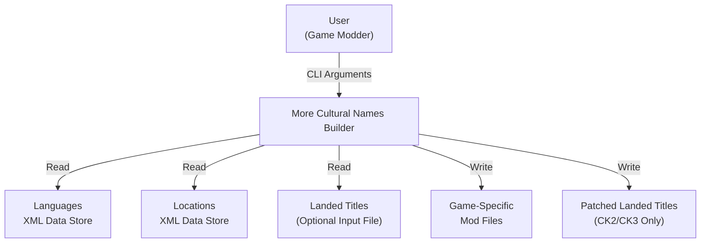
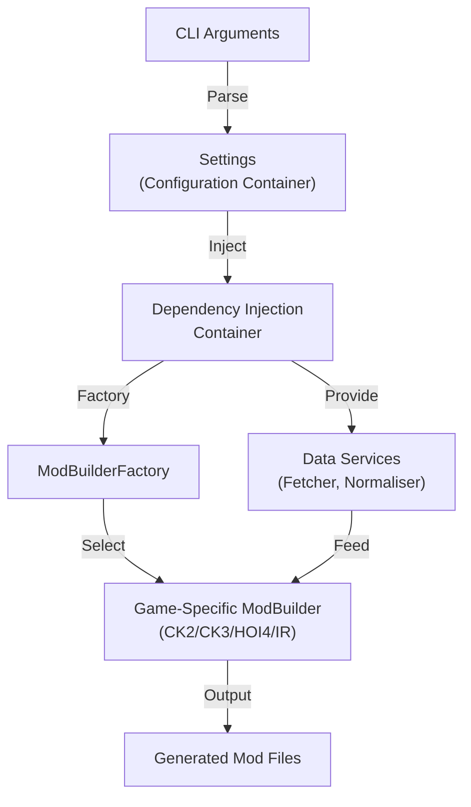
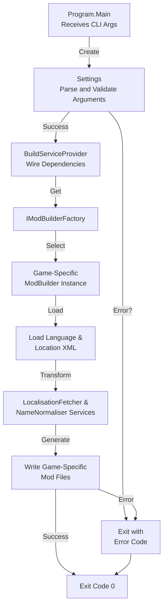
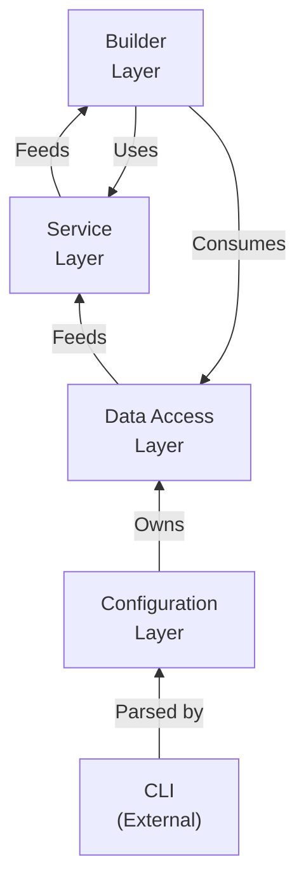

# More Cultural Names Builder Architecture

This document describes the current architecture of the More Cultural Names Builder, a console-based mod generation pipeline that reads localisation data and generates game-specific mod files for multiple game engines.

## 📑 Table of Contents

- [Purpose](#purpose)
- [System Context](#system-context)
- [Architectural Style](#architectural-style)
- [Runtime Flow](#runtime-flow)
- [Architectural Areas](#architectural-areas)
- [Data Architecture](#data-architecture)
- [Interfaces and Integrations](#interfaces-and-integrations)
- [External Dependencies](#external-dependencies)
- [Dependency Direction and Rules](#dependency-direction-and-rules)
- [Deployment and Operations](#deployment-and-operations)
- [Testing and Verification](#testing-and-verification)
- [Design Constraints](#design-constraints)
- [Source Map](#source-map)
- [Related Documentation](#related-documentation)

## 🎯 Purpose

The More Cultural Names Builder is a command-line tool that transforms linguistic and geographic data into game-specific mod files. It reads XML data stores for languages and locations, applies localisation and name normalisation, and generates output files compatible with Crusader Kings II, Crusader Kings III, Hearts of Iron IV, and Imperator: Rome. The architecture prioritises independent game-specific generation logic, reusable data transformation services, and fail-fast configuration validation.

## 🌐 System Context



The principal external boundaries are:

- **Data Stores:** The application reads two mandatory XML files (languages, locations) and an optional landed-titles file, maintaining no connection once data is loaded into memory.
- **Game Mod Files:** Output is written to a designated directory; the application owns file creation but not mod registration or game installation.
- **Operator Shell:** The application receives command-line arguments and exits with status codes; it does not maintain a runtime daemon.

## 🏗️ Architectural Style

More Cultural Names Builder implements a **console pipeline architecture** with these characteristics:

- **Stateless Processing:** Configuration is loaded once at startup from command-line arguments; application state does not accumulate during the build phase.
- **Factory-Based Polymorphism:** A factory selector determines the appropriate game-specific mod builder at runtime based on the `--game` argument.
- **Layered Dependency Injection:** Microsoft.Extensions.DependencyInjection wires services, repositories, and builders; loose coupling between layers is enforced via interfaces.
- **Fail-Fast Validation:** Configuration parsing and validation occur before the build phase, ensuring all required inputs are present before processing begins.



The principal architecture boundaries are:

- **Configuration Layer:** Parses and validates command-line arguments; raises errors for missing required values.
- **Data Layer:** Reads XML repositories; provides immutable entity objects to services.
- **Service Layer:** Transforms and normalises localisation and name data; independent of game logic.
- **Builder Layer:** Game-specific implementations of `IModBuilder`; each builder consumes service outputs and writes mod-format files.

## 🔄 Runtime Flow



The principal runtime sequence is:

1. **Argument Parsing:** `Settings` constructor parses all command-line arguments and validates required fields; raises exception if validation fails.
2. **Dependency Injection Setup:** `BuildServiceProvider()` instantiates the DI container and registers all singletons (settings, repositories, services, factory).
3. **Builder Selection:** `IModBuilderFactory.GetModBuilder(settings)` instantiates the correct game-specific builder based on `settings.Mod.GameId`.
4. **Build Execution:** The selected builder loads data from XML repositories, applies data transformation services, and writes output files.
5. **Process Exit:** Application terminates with status code 0 on success or non-zero on unhandled exception.

## 🗂️ Architectural Areas

### Configuration

**Paths:**
- `MoreCulturalNamesBuilder/Configuration/`

**Responsibilities:**
- Parse command-line arguments using `NuciCLI.Arguments.ArgumentParser`.
- Validate required and optional argument presence and format.
- Expose normalised configuration via `Settings`, `InputSettings`, `ModSettings`, and `OutputSettings`.
- Support legacy alias arguments (`--output`/`--out`, `--version`/`--ver`) for backward compatibility with existing mod build scripts.

**Boundary rules:**
- Configuration is instantiated once at application startup; it must be immutable after construction.
- No I/O operations occur during Settings instantiation (parsing only).
- Invalid arguments cause an exception; error recovery is the caller's responsibility.

### Data Access

**Paths:**
- `MoreCulturalNamesBuilder/DataAccess/DataObjects/`

**Responsibilities:**
- Define domain entity classes (`LanguageEntity`, `LocationEntity`, `NameEntity`, `LanguageCodeEntity`, `GameIdEntity`).
- Serve as data transfer objects between XML repositories and service layer.
- Maintain no business logic; entities are passive data containers.

**Boundary rules:**
- Entities are instantiated by `NuciDAL` XML repositories; configuration layer does not instantiate entities directly.
- Entities are read-only; mutations occur only in mapping and service layers.

### Service Layer

**Paths:**
- `MoreCulturalNamesBuilder/Service/`
- `MoreCulturalNamesBuilder/Service/Mapping/`

**Responsibilities:**
- `LocalisationFetcher`: Retrieves localisation data for a given location and language, normalising keys for consistency.
- `NameNormaliser`: Applies linguistic rules to normalise names (e.g., handling special characters, phonetic transformations).
- Mapping services convert between entity and model objects (see Data Architecture).

**Boundary rules:**
- Services are stateless; all dependencies are injected and immutable.
- Services depend only on data entities and interfaces; they must not reference builder implementations.

### Mod Builders

**Paths:**
- `MoreCulturalNamesBuilder/Service/ModBuilders/`

**Responsibilities:**
- `IModBuilder`: Interface defining the `Build()` contract.
- `ModBuilder`: Base class providing common file generation logic for all games (shared localisation file format).
- Game-specific builders (`CK2ModBuilder`, `CK3ModBuilder`, `HOI4ModBuilder`, `ImperatorRomeModBuilder`): Extend `ModBuilder` and implement game-specific file output (e.g., `00_cultural_names.txt` for CK series, custom formats for HOI4 and IR).
- `IModBuilderFactory`: Selects the appropriate builder at runtime.

**Boundary rules:**
- All builders implement `IModBuilder` and inherit from `ModBuilder`.
- Builders depend on service layer (`ILocalisationFetcher`, `INameNormaliser`) but not on each other.
- Game-specific builders are instantiated only once during the build phase.

## 💾 Data Architecture

The application processes two principal data flows:

1. **Localisation Data Flow:**
   - **Source:** Language and Location XML files (external, user-provided).
   - **Load:** Parsed into `LanguageEntity` and `LocationEntity` collections via `NuciDAL` XML repositories.
   - **Transform:** `LocalisationFetcher` maps entities to application models and retrieves localised place names.
   - **Persist:** Game-specific builders write localisation strings to game mod format files (e.g., `00_cultural_names.txt`).

2. **Name Normalisation Flow:**
   - **Source:** Location names from XML.
   - **Transform:** `NameNormaliser` applies linguistic rules to normalise diacritics and special characters.
   - **Persist:** Normalised names are included in generated mod files.

| Data or Store | Owner | Representation and Storage | Lifecycle or Consistency |
|---|---|---|---|
| `LanguageEntity`, `LocationEntity` collections | `IFileRepository<T>` (NuciDAL) | Loaded entirely into memory during startup; discarded on exit. | No mutations after repository load; guaranteed consistency by immutability. |
| `Language`, `Location`, `Localisation` models | Service layer | Derived from entities; intermediate representation for builder consumption. | Created on-demand during build phase; no persistent caching. |
| Generated mod files | `ModBuilder` | Game-specific format (e.g., CK3 localisation files, HOI4 custom format). | Written once to `OutputSettings.OutputPath`; no subsequent updates within a single build. |

## 🔌 Interfaces and Integrations

| Interface or Integration | Direction | Contract | Owner | Failure Semantics |
|---|---|---|---|---|
| CLI Arguments | Inbound | Command-line string array, parsed by `ArgumentParser`. | Configuration layer | Unrecognised or missing required arguments raise exception; application terminates. |
| XML Data Stores | Inbound | Language and Location XML files at paths specified by `--lang` and `--loc`. | Data access layer | File-not-found or XML parse errors raise exception; application terminates. |
| Landed Titles File (Optional) | Inbound/Outbound | CK2/CK3 landed-titles format; read, patched, and written to output directory. | `CK2ModBuilder`, `CK3ModBuilder` | File read failure: exception. Invalid format: silent skip or partial output (determined by builder). |
| Game Mod Output | Outbound | Game-specific format (e.g., `.txt` for CK3 localisation, custom formats for HOI4/IR). | Builders | File write errors raise exception; application terminates. |

## 🧭 Dependency Direction and Rules

The dependency graph enforces a strict layering:



The principal dependency rules are:

- Configuration depends only on NuciCLI and built-in .NET types.
- Data access (`NuciDAL` repositories) is instantiated by the DI container; no other layers instantiate repositories.
- Service layer depends on data entities and interfaces; no dependency on builders or configuration.
- Builders depend on services and data layer; builders do not depend on each other.
- **Prohibited:** No circular dependencies; no downward dependencies (builder → service → builder).
- **Prohibited:** Configuration layer must not be referenced by service, builder, or data access layers. Builders must not instantiate other builders.

## 🚀 Deployment and Operations

More Cultural Names Builder is a stateless, single-invocation console application. Each execution is independent; no server, persistent state, or background processes are maintained.

| Concern | Current Design | Architectural Consequence |
|---|---|---|
| **Process Topology** | Single-threaded console process; one build per invocation. | No concurrency primitives required; simplicity aids debugging and portability. |
| **Execution Model** | Stateless pipeline; all input loaded at startup, output written at completion. | No partial results or resumable builds; failed builds must be re-executed from scratch. |
| **Persistent State** | None. Output files are independent; no shared state or locks. | Multiple builds can run in parallel on the same system without coordination. |
| **Exit Semantics** | Status code 0 on success; non-zero on exception. | Shell scripts can chain builds or implement conditional logic based on exit code. |
| **Output Directory** | User-specified via `--output` or `--out`. | Caller must ensure directory exists and is writable; application does not create intermediate directories. |
| **Scaling** | Not applicable. | Scaling is achieved by running multiple independent processes, not by changing the application runtime. |

## ✅ Testing and Verification

The project includes a unit test suite (`MoreCulturalNamesBuilder.UnitTests`) that verifies:

- **Configuration Parsing:** `SettingsTests` validate argument parsing, required field detection, and alias argument normalization.
- **Name Normalisation:** `NameNormaliserTests` verify linguistic transformation rules (special character handling, diacritics).

Execute the principal automated verification with:

```bash
dotnet test
```

**Test Boundaries:**
- Unit tests cover the configuration and service layers; builder layer integration tests are absent, making CK2/CK3/HOI4/IR-specific output formats unvalidated.
- Data access layer is not mocked; tests use actual XML deserialization.

**Material Coverage Gaps:**
- No end-to-end tests that generate actual mod files and verify output format.
- No tests for `ModBuilder` base class or game-specific implementations.
- No validation of generated mod file syntax or game compatibility.

## ⚠️ Design Constraints

- **No Directory Creation:** The application does not create intermediate directories; output directory must exist and be writable before execution.
- **Single Invocation Per Process:** Each process handles exactly one build; no daemon or persistent server mode.
- **Immutable Configuration:** Once parsed, settings cannot be modified; every build uses the same parsed configuration.
- **In-Memory Data Loading:** All localisation data is loaded into memory during startup; no streaming or pagination of large datasets.
- **No Transaction Support:** Failed builds do not roll back partial output files; idempotency is caller responsibility.
- **Game Alias Requirement:** The `--game` argument requires an exact string match (CK2, CK3, HOI4, IR); no fuzzy matching or abbreviations.
- **Alias Argument Handling:** `--output`/`--out` and `--version`/`--ver` pairs must both be provided or validation fails, even when only one pair is used; this is a validation gap introduced to support legacy scripts.

## 🗺️ Source Map

| Area | Path |
|---|---|
| Configuration parsing and argument validation | `MoreCulturalNamesBuilder/Configuration/` |
| Domain entity definitions | `MoreCulturalNamesBuilder/DataAccess/DataObjects/` |
| Data transformation services and mapping | `MoreCulturalNamesBuilder/Service/` |
| Game-specific mod builders | `MoreCulturalNamesBuilder/Service/ModBuilders/` |
| Unit test suite | `MoreCulturalNamesBuilder.UnitTests/` |
| Dependency injection setup and entry point | `MoreCulturalNamesBuilder/Program.cs` |

## 📚 Related Documentation

- [README.md](./README.md) – Usage, installation, and capabilities overview.
- [ROADMAP.md](./ROADMAP.md) – Planned features and evolution.
