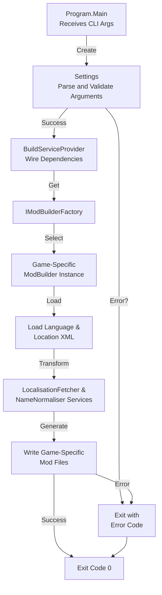

# Architecture Overview

This document provides a comprehensive architectural decomposition of the More Cultural Names Builder, derived from implementation analysis.

## Architectural Style

The application implements a **console pipeline architecture** with these defining characteristics:

| Characteristic | Implementation |
|----------------|----------------|
| **Stateless Processing** | Configuration loaded once at startup; no state accumulation during build |
| **Factory-Based Polymorphism** | `ModBuilderFactory` selects game-specific builder at runtime via `--game` argument |
| **Layered Dependency Injection** | `Microsoft.Extensions.DependencyInjection` wires services, repositories, and builders |
| **Fail-Fast Validation** | Configuration parsing/validation occurs before build phase |

## Layered Architecture

```
┌─────────────────────────────────────────────────────────────────┐
│                        CLI Arguments                            │
└─────────────────────────────┬───────────────────────────────────┘
                              ▼
┌─────────────────────────────────────────────────────────────────┐
│                   Configuration Layer                           │
│  Settings, InputSettings, ModSettings, OutputSettings          │
└─────────────────────────────┬───────────────────────────────────┘
                              ▼
┌─────────────────────────────────────────────────────────────────┐
│                   Dependency Injection Container                │
│  Registers: Settings, Repositories, Services, Factory          │
└─────────────────────────────┬───────────────────────────────────┘
                              ▼
┌─────────────────────────────────────────────────────────────────┐
│                      ModBuilderFactory                          │
│  Selects: CK2ModBuilder / CK3ModBuilder / HOI4ModBuilder /     │
│           ImperatorRomeModBuilder                               │
└─────────────────────────────┬───────────────────────────────────┘
                              ▼
┌─────────────────────────────────────────────────────────────────┐
│                      Builder Layer                              │
│  ModBuilder (base) → Game-specific implementations             │
│  Consumes: ILocalisationFetcher, INameNormaliser               │
└─────────────────────────────┬───────────────────────────────────┘
                              ▼
┌─────────────────────────────────────────────────────────────────┐
│                      Service Layer                              │
│  LocalisationFetcher, NameNormaliser, Mapping extensions       │
└─────────────────────────────┬───────────────────────────────────┘
                              ▼
┌─────────────────────────────────────────────────────────────────┐
│                      Data Access Layer                          │
│  XmlRepository<LanguageEntity>, XmlRepository<LocationEntity>  │
└─────────────────────────────┬───────────────────────────────────┘
                              ▼
┌─────────────────────────────────────────────────────────────────┐
│                      XML Data Stores                            │
│  languages.xml, locations.xml (user-provided)                  │
└─────────────────────────────────────────────────────────────────┘
```

## Dependency Direction Rules

The dependency graph enforces strict layering:

```
CLI Arguments
     │
     ▼
Configuration Layer (owns)
     │
     ▼
Data Access Layer (feeds)
     │
     ▼
Service Layer (feeds)
     │
     ▼
Builder Layer (uses Service, consumes Data Access)
```

**Prohibited Dependencies:**
- No circular dependencies
- No downward dependencies (Builder → Service → Builder)
- Configuration layer must not be referenced by Service, Builder, or Data Access layers
- Builders must not instantiate other builders

## Runtime Flow



### Principal Runtime Sequence

1. **Argument Parsing** (`Settings` constructor): Parses all command-line arguments, validates required fields, raises exception on validation failure
2. **Dependency Injection Setup** (`BuildServiceProvider()`): Instantiates DI container, registers all singletons (settings, repositories, services, factory)
3. **Builder Selection** (`IModBuilderFactory.GetModBuilder(settings)`): Instantiates correct game-specific builder based on `settings.Mod.Game`
4. **Build Execution**: Selected builder loads data from XML repositories, applies data transformation services, writes output files
5. **Process Exit**: Terminates with status code 0 on success, non-zero on unhandled exception

## Architectural Areas

### Configuration Layer
**Path:** `MoreCulturalNamesBuilder/Configuration/`

**Responsibilities:**
- Parse command-line arguments using `NuciCLI.Arguments.ArgumentParser`
- Validate required and optional argument presence and format
- Expose normalised configuration via `Settings`, `InputSettings`, `ModSettings`, `OutputSettings`
- Support legacy alias arguments (`--output`/`--out`, `--version`/`--ver`) for backward compatibility

**Boundary Rules:**
- Configuration instantiated once at startup; immutable after construction
- No I/O during Settings instantiation (parsing only)
- Invalid arguments cause exception; error recovery is caller's responsibility

### Data Access Layer
**Path:** `MoreCulturalNamesBuilder/DataAccess/DataObjects/`

**Responsibilities:**
- Define domain entity classes (`LanguageEntity`, `LocationEntity`, `NameEntity`, `LanguageCodeEntity`, `GameIdEntity`)
- Serve as DTOs between XML repositories and service layer
- Maintain no business logic; entities are passive data containers

**Boundary Rules:**
- Entities instantiated by `NuciDAL` XML repositories; configuration layer does not instantiate entities directly
- Entities are read-only; mutations occur only in mapping and service layers

### Service Layer
**Path:** `MoreCulturalNamesBuilder/Service/` and `MoreCulturalNamesBuilder/Service/Mapping/`

**Responsibilities:**
- `LocalisationFetcher`: Retrieves localisation data for location/language, normalising keys for consistency
- `NameNormaliser`: Applies linguistic rules to normalise names (diacritics, phonetic transformations)
- Mapping extensions: Convert between entity and model objects

**Boundary Rules:**
- Services are stateless; all dependencies injected and immutable
- Services depend only on data entities and interfaces; no builder references

### Builder Layer
**Path:** `MoreCulturalNamesBuilder/Service/ModBuilders/`

**Responsibilities:**
- `IModBuilder`: Interface defining `Build()` contract
- `ModBuilder`: Base class providing common file generation logic
- Game-specific builders: `CK2ModBuilder`, `CK3ModBuilder`, `HOI4ModBuilder`, `ImperatorRomeModBuilder`
- `IModBuilderFactory`: Runtime builder selection

**Boundary Rules:**
- All builders implement `IModBuilder` and inherit from `ModBuilder`
- Builders depend on service layer (`ILocalisationFetcher`, `INameNormaliser`) but not on each other
- Game-specific builders instantiated only once during build phase

## Data Architecture

### Two Principal Data Flows

#### 1. Localisation Data Flow
```
Source: Language & Location XML files (user-provided)
    │
    ▼
Load: Parsed into LanguageEntity/LocationEntity collections via NuciDAL XmlRepository
    │
    ▼
Transform: LocalisationFetcher maps entities to application models, retrieves localised place names
    │
    ▼
Persist: Game-specific builders write localisation strings to game mod format files
```

#### 2. Name Normalisation Flow
```
Source: Location names from XML
    │
    ▼
Transform: NameNormaliser applies linguistic rules to normalise diacritics/special characters
    │
    ▼
Persist: Normalised names included in generated mod files
```

### Data Stores and Lifecycle

| Data/Store | Owner | Representation & Storage | Lifecycle/Consistency |
|------------|-------|-------------------------|----------------------|
| `LanguageEntity`, `LocationEntity` collections | `IFileRepository<T>` (NuciDAL) | Loaded entirely into memory at startup; discarded on exit | No mutations after load; guaranteed consistency by immutability |
| `Language`, `Location`, `Localisation` models | Service layer | Derived from entities; intermediate representation for builders | Created on-demand during build; no persistent caching |
| Generated mod files | `ModBuilder` | Game-specific format (CK3 localisation, HOI4 custom, etc.) | Written once to `OutputSettings.OutputPath`; no subsequent updates |

## Interfaces and Integrations

| Interface/Integration | Direction | Contract | Owner | Failure Semantics |
|----------------------|-----------|----------|-------|-------------------|
| CLI Arguments | Inbound | String array parsed by `ArgumentParser` | Configuration | Unrecognised/missing required args raise exception; app terminates |
| XML Data Stores | Inbound | Language/Location XML at `--lang`/`--loc` paths | Data Access | File-not-found or XML parse errors raise exception; app terminates |
| Landed Titles File (Optional) | Inbound/Outbound | CK2/CK3 landed-titles format; read, patched, written | `CK2ModBuilder`, `CK3ModBuilder` | Read failure: exception. Invalid format: silent skip or partial output |
| Game Mod Output | Outbound | Game-specific format (`.txt` for CK3, custom for HOI4/IR) | Builders | Write errors raise exception; app terminates |

## Deployment and Operations

| Concern | Current Design | Architectural Consequence |
|---------|----------------|---------------------------|
| **Process Topology** | Single-threaded console process; one build per invocation | No concurrency primitives; simplicity aids debugging/portability |
| **Execution Model** | Stateless pipeline; all input loaded at startup, output at completion | No partial results or resumable builds; failed builds re-executed from scratch |
| **Persistent State** | None. Output files independent; no shared state/locks | Multiple builds can run in parallel without coordination |
| **Exit Semantics** | Status code 0 on success; non-zero on exception | Shell scripts can chain builds or implement conditional logic |
| **Output Directory** | User-specified via `--output`/`--out` | Caller must ensure directory exists/writable; app doesn't create intermediate dirs |
| **Scaling** | Not applicable | Scaling via multiple independent processes, not runtime changes |

## Design Constraints

- **No Directory Creation**: Application doesn't create intermediate directories; output directory must exist and be writable
- **Single Invocation Per Process**: Each process handles exactly one build; no daemon/server mode
- **Immutable Configuration**: Once parsed, settings cannot be modified
- **In-Memory Data Loading**: All localisation data loaded into memory at startup; no streaming/pagination
- **No Transaction Support**: Failed builds don't roll back partial output; idempotency is caller responsibility
- **Game Alias Requirement**: `--game` requires exact string match (CK2, CK3, HOI4, IR); no fuzzy matching
- **Alias Argument Handling**: `--output`/`--out` and `--version`/`--ver` pairs must both be provided or validation fails (validation gap for legacy script support)

## Source Map

| Area | Path |
|------|------|
| Configuration parsing/validation | `MoreCulturalNamesBuilder/Configuration/` |
| Domain entity definitions | `MoreCulturalNamesBuilder/DataAccess/DataObjects/` |
| Data transformation services/mapping | `MoreCulturalNamesBuilder/Service/` |
| Game-specific mod builders | `MoreCulturalNamesBuilder/Service/ModBuilders/` |
| Unit test suite | `MoreCulturalNamesBuilder.UnitTests/` |
| DI setup and entry point | `MoreCulturalNamesBuilder/Program.cs` |

## Related Documentation

- [Configuration System](configuration-system.md)
- [Data Access Layer](data-access-layer.md)
- [Service Layer](service-layer.md)
- [Mod Builders](mod-builders.md)
- [Data Models](data-models.md)
- [Name Normalisation](name-normalisation.md)
- [Testing](testing.md)
- [Deployment & Operations](deployment-operations.md)